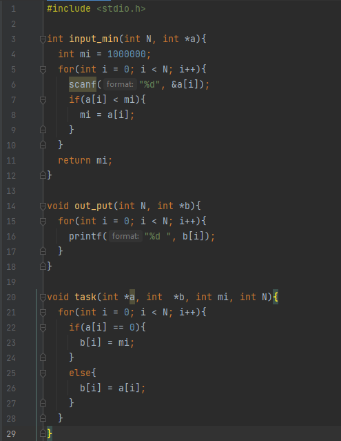
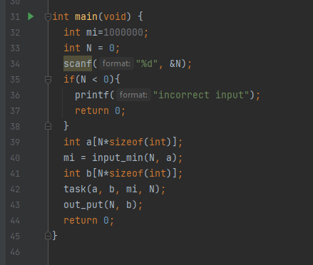
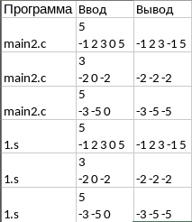

# Первое индивидуальное домашнее задание по АВС
## Вариант 15, Ермолаев Глеб Олегович, БПИ216
### Задание:
Сформировать массив B из элементов массива A заменой всех
нулевых элементов значением минимального элемента.
### Результаты:
### На 5 баллов:



```
 int input_min(int N, int *a) - поиск минимального элемента, на входе получает целочисленную переменную N(размер массива), а также указатель на массив
 void out_put(int N, int *b) - вывод массива, на входе получает целочисленную переменную N(размер массива), а также указатель на массив
 void task(int *a, int  *b, int mi, int N) - формирование массива с заменой нулевых элементов, на входе получает 2 указателя на массивы, минимальный элемент mi, а также размер массива N
 ```
 
 ### Результаты тестировния 
 
 
 
 По результатам тестирования делаем однозначный вывод, что программы работают эквивалентно и правильно.
 
Команды для проверки:
```
gcc 1.s
gcc ./a.out
```

 
